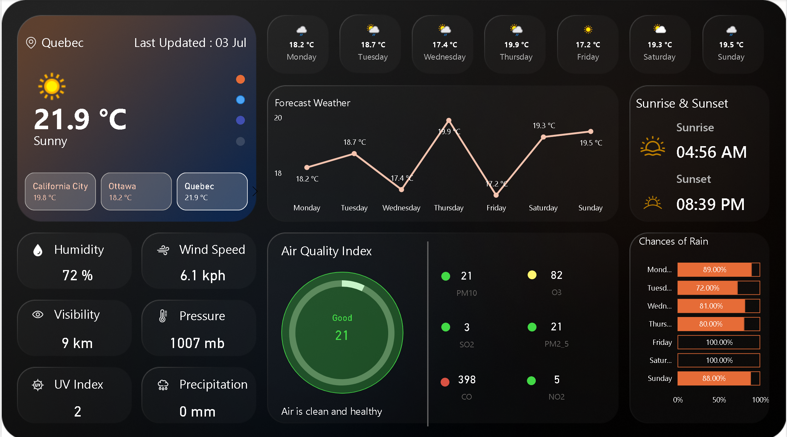

# 🌦️ Live Weather Dashboard in Power BI using WeatherAPI.com

This project is a **Live Weather Dashboard** built entirely in **Microsoft Power BI**, connected to real-time weather data through the [WeatherAPI.com](https://www.weatherapi.com/) service.

It provides a comprehensive and interactive visual overview of current weather conditions, forecasts, and air quality for selected locations.

---

## 📌 Features

- 📍 Multi-city support: Quebec, Ottawa, California City
- 🌡️ Current weather metrics:
  - Temperature
  - Humidity
  - Wind speed
  - Pressure
  - Visibility
  - UV Index
- 📅 7-Day Forecast Line Chart
- 🌧️ Rain Probability Bars (Daily Chance of Rain)
- 🌇 Sunrise & Sunset Times
- 🫁 Air Quality Index (AQI) with pollutant breakdown:
  - PM2.5
  - PM10
  - CO
  - NO2
  - SO2
  - O3

---

## 🔗 Data Source

- **API Provider**: [WeatherAPI.com](https://www.weatherapi.com/)
- **Integration**: Web connector in Power BI using dynamic API calls

---

## 🛠 Tools Used

| Tool       | Purpose                         |
|------------|---------------------------------|
| Power BI   | Data modeling & visualization   |
| Power Query (M) | API connection & transformation |
| DAX        | Measures & calculated columns   |
| WeatherAPI | Real-time weather data          |

---

## 🚀 How It Works

1. **Power Query** is used to make API calls to WeatherAPI.com.
2. **JSON response** is parsed and converted into structured Power BI tables.
3. Dynamic parameters allow switching between cities or refreshing data live.
4. Data is visualized using line graphs, bar charts, cards, and gauges.

---

## 📂 File Contents

| File                          | Description                            |
|-------------------------------|----------------------------------------|
| `Live_Weather.pbix`           | Main Power BI dashboard file           |
| `README.md`                   | Project overview                       |
| `Live_Weather.png`            | Dashboard screenshot                   |

---

## 🖼 Preview

---

## 🔑 API Key Note

To use or refresh this dashboard with your own data:
1. Sign up at [weatherapi.com](https://www.weatherapi.com/) for a free API key.
2. Open Power BI → **Transform Data** → Update the **API Key** parameter.

---

## 👤 Author

**Sumit Chhillar**  
📍 Based in Canada  
🔗 [GitHub](https://github.com/Sumit170694)  
🔗 [LinkedIn](https://www.linkedin.com/in/sumit-chhillar-020a36323/)

---

## 📃 License

This project is open-source and available under the [MIT License](LICENSE).

---

## 💬 Feedback

Feel free to connect on LinkedIn or open issues/pull requests for suggestions or improvements!

